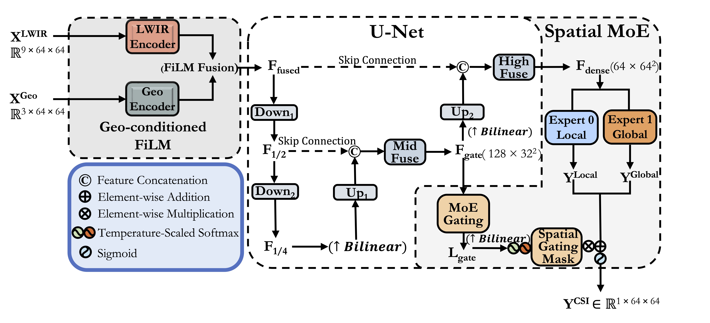
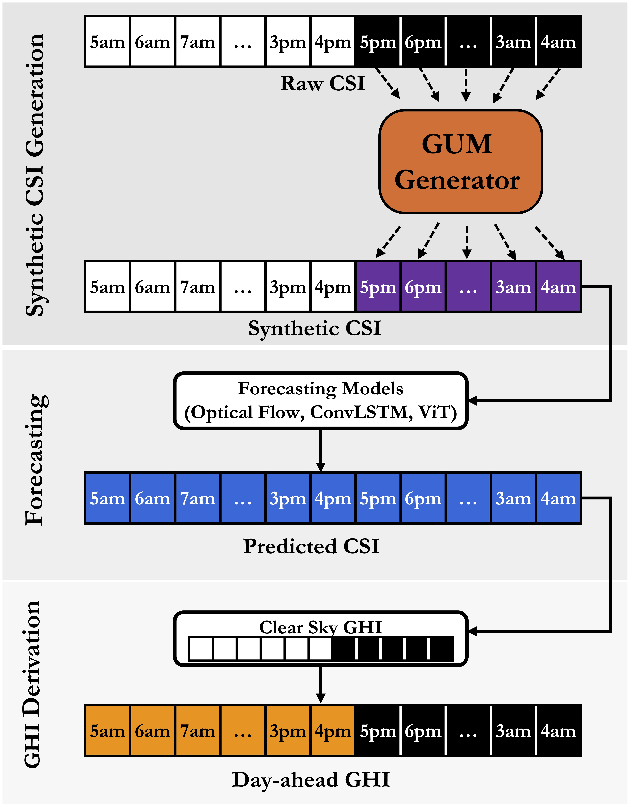

# Advancing Day-Ahead Spatiotemporal Solar Irradiance Forecasting through Synthetic Nighttime Data Integration

[](https://www.python.org/downloads/)
[](https://pytorch.org/)
[](https://opensource.org/licenses/MIT)

> **Official Repository** for the paper: *"Advancing Day-Ahead Spatiotemporal Solar Irradiance Forecasting through Synthetic Nighttime Data Integration"*.

## 📖 Overview & Motivation

While deep learning architectures have significantly advanced intra-day solar forecasting, extending their spatiotemporal predictive skill to day-ahead (24-hour) horizons remains a critical bottleneck. A major cause of this performance degradation is the **nighttime observation void**. Because solar irradiance naturally drops to zero at night, standard data-driven models lose active tracking of cloud kinematics for over 10 hours. Consequently, early-morning predictions are severely compromised, forcing models to infer current cloud kinematics from stale data recorded prior to the previous sunset.

To resolve this challenge, we propose a continuity-aware framework based on a **Geo-conditioned U-Net Mixture-of-Experts (GUM)**. 

Our framework generates physically consistent synthetic nighttime Clear Sky Index (CSI) time series from geostationary satellite observations (Himawari-8/9) and reconstructs a seamless 24-hour CSI representation. Benchmarking over Hong Kong (2021–2023) demonstrates that bridging this diurnal gap yields consistent performance gains across architectures, **reducing GHI forecasting errors by 2.1% to 26.4%** and elevating forecasting skill over persistence from 13.71% to 20.45%.

<div align="center">
  
  <br><br>
  
  <p><i>Figure 1: Overview architecture of the Geo-conditioned U-Net Mixture-of-Experts (GUM) framework. </i></p>
</div>

> **Note on Scope:** This repository focuses strictly on the core contribution of the paper: **Data preparation, GUM model training, and Synthetic Nighttime CSI generation**. The downstream sequence-to-sequence forecasting models used for benchmarking in the paper are standard baseline architectures and are omitted here to keep the repository focused on the novel continuous-tracking framework.

---

## 📂 Repository Structure

The repository is structured to facilitate easy reproduction of our pipeline. All core logic resides in `src/`, while step-by-step interactive demonstrations are provided in the `tutorial/` directory.

```text
├── src/                        # Core Python modules for the GUM pipeline
│   ├── __init__.py             # Package initializer
│   ├── bands_and_cams.py       # Handlers for loading and pairing Himawari & CAMS data
│   ├── data_preprocessing.py   # Feature extraction, geographic alignment, and tensor building
│   ├── dataset.py              # PyTorch Dataset definitions (e.g., BandsCamsDataset)
│   ├── evaluate.py             # Metrics computation (RMSE, rRMSE, MAE, MBE,)
│   ├── loss.py                 # Custom loss functions (e.g., MoE balance loss)
│   ├── model.py                # Model architectures (Geo-conditioned U-Net MoE)
│   ├── plot.py                 # Visualization tools for CSI/GHI spatial and sequence plots
│   ├── train.py                # Training loops, learning rate scheduling, and checkpoints
│   └── utils.py                # Helper functions (tensor padding, cropping, day/night splits)
│
├── Tutorial Notebooks/                   # Interactive notebooks demonstrating the pipeline
│   ├── 1_Prepare_raw_data.ipynb
│   ├── 2_Train_Eval_Model.ipynb
│   └── 3_Synethic_tracks.ipynb
│
├── Data/                       # Project datasets and model outputs (Ignored in Git)
│   ├── CAMS/                   # Copernicus Atmosphere Monitoring Service irradiance data
│   ├── bands/                  # Processed Himawari-8/9 satellite tensors
│   ├── elevation/              # Static geographic features (e.g., HK DEM/elevation maps)
│   ├── grid/                   # Himawari-8/9 longitude and latitude grid mappings
│   └── syntheticCSI/           # Generated continuous synthetic nighttime CSI tracking arrays
│
├── .gitignore                  # Git ignore rules (excludes .venv, Data/, Model_checkpoint/)
├── environment.yml             # Conda environment configuration
├── requirements.txt            # Pip requirements
├── setup.py                    # Local package installer for the 'src' module
└── README.md                   # Project documentation
```

---

## ⚙️ Environment Setup

To ensure the `tutorial` notebooks can seamlessly import the `src` modules regardless of your working directory, the repository is configured to be installed as a local package.

Pick **one** of the following workflow environments:

### Option A: Conda (Recommended)
```bash
# 1. Create and activate the environment
mamba env create -f environment.yml   # (or use conda env create)
mamba activate solar-forecasting-hk

# 2. Install the local project in editable mode
pip install -e .
```

### Option B: Pip / Virtualenv
```bash
# 1. Create and activate virtual environment (bypassing system pip limits if necessary)
python3 -m venv .venv
source .venv/bin/activate

# 2. Upgrade pip and install dependencies/local project
pip install --upgrade pip
pip install -e .
```

---

## 🚀 Pipeline Tutorials

The workflow is broken down into three sequential Jupyter Notebooks located in the `Tutorial Notebooks/` folder. We recommend running them in the following order to reproduce the paper's methodology:

### 1. Data Preparation & Pairing
**Notebook:** `Tutorial Notebooks/1.Prepare_raw_data.ipynb`
* Processes raw Himawari-8/9 Long-wave Infrared (LWIR) files.
* Segments the observations by diurnal cycles (separating strict daytime from nighttime/twilight).
* Temporally aligns the satellite bands with ground-truth CAMS irradiance data using a robust 6-minute fuzzy matching algorithm.

### 2. GUM Model Training & Evaluation
**Notebook:** `Tutorial Notebooks/2.Train_Eval_Model.ipynb`
* Assembles the multi-channel input tensors (combining atmospheric bands with geographic elevation maps).
* Performs a chronologically stratified Train/Val/Test split.
* Trains the **Geo-conditioned U-Net Mixture-of-Experts (GUM)** using the daytime dataset to learn the mapping between cloud kinematics and ground irradiance.
* Evaluates the model comprehensively, generating standard metrics (RMSE, rRMSE, MAE, MBE, R²) partitioned by sky conditions and time-of-day.

### 3. Synthetic Nighttime Track Generation
**Notebook:** `Tutorial Notebooks/3.Synethic_tracks.ipynb`
* Loads the trained GUM checkpoint and applies it in inference mode across the nocturnal and twilight satellite observations.
* Dynamically crops and processes the outputs to generate synthetic nighttime Clear Sky Index (CSI) tensors.
* Integrates the predicted nighttime arrays with the true daytime arrays, yielding a seamless, temporally aligned, 24-hour continuous tracking dataset ready for downstream forecasting models.

<div align="center">
  <br>
  
  <p><i>Figure 2: Sequence demonstrating the generation and integration of synthetic nighttime CSI tracks into the continuous 24-hour timeline.</i></p>
</div>
---

## 📊 Key Findings

By successfully mitigating the nocturnal observation void, the synthetic nighttime data integration framework achieves:
* **Enhanced Spatial Continuity:** Seamless transitions between evening decay and early-morning initialization.
* **Significant Error Reduction:** Downstream GHI forecasting errors reduced by **2.1% to 26.4%** across tested deep-learning and physics-based baselines.
* **Superior Early-Morning Tracking:** Elevates global forecasting skill over persistence from **13.71% to 20.45%** across a 16-grid benchmark domain.

---